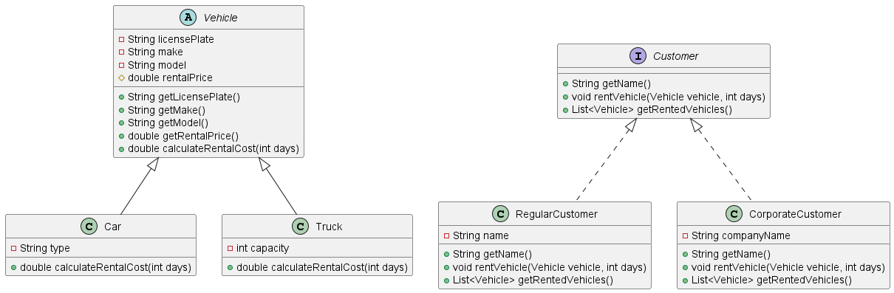

# 🚗 Java Vehicle Rental System - OOP Demonstration

## 📋 Project Overview
This project demonstrates advanced implementation of Object-Oriented Programming (OOP) principles in Java, within the context of a vehicle rental system.

The project showcases mastery of core OOP concepts including:
- **Inheritance**
- **Polymorphism**
- **Encapsulation**
- **Abstraction**
- **Interfaces**
- **Abstract Classes**
- **Method Overriding & Overloading**
- **Dynamic Binding**

---

## 🎯 Exercise Objective

Design and implement a simple system to demonstrate key object-oriented programming concepts such as:
- Interface
- Package/Namespace
- Access Modifiers (public, protected, private)
- Method Overloading
- Method Overriding
- Dynamic Binding
- Abstract Classes
- UML Class Diagrams

---

## 📖 Scenario

A simple simulation of a **vehicle rental system** that manages vehicles and customers, with different types of vehicles and customers having unique behaviors and attributes.

---

## 🏗️ System Architecture

### UML Class Diagram



### Class Structure

#### 1. **Abstract Class: `Vehicle`**
Base class for all vehicle types.

**Attributes:**
- `licensePlate` (String, private)
- `make` (String, private)
- `model` (String, private)
- `rentalPrice` (double, protected)

**Methods:**
- `getLicensePlate()`: Returns the license plate
- `getMake()`: Returns the make of the vehicle
- `getModel()`: Returns the model of the vehicle
- `getRentalPrice()`: Returns the rental price
- `calculateRentalCost(int days)`: **Abstract method** - calculates rental cost based on days

#### 2. **Concrete Classes: `Car` & `Truck`**

**`Car`:**
- Additional Attribute: `type` (String, private)
- Overrides `calculateRentalCost(int days)`: Fixed daily rental cost

**`Truck`:**
- Additional Attribute: `capacity` (int, private)
- Overrides `calculateRentalCost(int days)`: Fixed daily rental cost + additional cost based on capacity

#### 3. **Interface: `Customer`**
Defines the contract for all customer types.

**Methods:**
- `getName()`: Returns customer name
- `rentVehicle(Vehicle vehicle, int days)`: Processes vehicle rental
- `getRentedVehicles()`: Returns list of rented vehicles

#### 4. **Customer Implementations: `RegularCustomer` & `CorporateCustomer`**

**`RegularCustomer`:**
- Attribute: `name` (String, private)
- Implements all interface methods

**`CorporateCustomer`:**
- Additional Attribute: `companyName` (String, private)
- Overrides `rentVehicle()`: Applies corporate discount on rentals

#### 5. **Main Class: `VehicleRental`**
- Creates instances of vehicles and customers
- Demonstrates the rental process
- Displays vehicles and their rental costs
- Uses lists to manage rented vehicles

---

## 🎯 OOP Concepts - Comprehensive Guide

### Differences Between Abstract Class and Concrete Class

| Criterion | Abstract Class | Concrete Class |
|-----------|----------------|----------------|
| **Definition** | Written with `abstract` keyword | Regular class without `abstract` |
| **Object Creation** | **Cannot** create instance directly | **Can** create instance with `new` |
| **Main Purpose** | Serve as template/base for other classes | Represent real objects in the system |
| **Abstract Methods** | **Can** contain abstract methods (without body) | **Cannot** contain abstract methods |
| **Regular Methods** | **Can** contain methods with full implementation | **Must** have all methods implemented |
| **Inheritance** | Child classes **must** implement abstract methods | Can inherit from another class or not |
| **Fields** | Can contain regular fields | Can contain regular fields |
| **Constructor** | Can contain (called from child classes) | Can contain |

---

### Complete Comparison: Interface vs Abstract Class vs Concrete Class vs Instance

| Criterion | Interface | Abstract Class | Concrete Class | Instance/Object |
|-----------|-----------|----------------|----------------|-----------------|
| **Definition** | Written with `interface` | Written with `abstract class` | Regular class with `class` | Real object in memory |
| **Creation** | **Cannot** create instance | **Cannot** create instance | **Can** create instance with `new` | Created using `new ClassName()` |
| **Purpose** | Contract/commitment for implementation | Template/base for other classes | Represent real objects | Actual entity of a class in memory |
| **Abstract Methods** | **All** methods are abstract (before Java 8) | **Can** contain | **Cannot** contain | N/A - only calls methods |
| **Methods with Implementation** | Can (from Java 8: default, static) | **Can** contain | **Must** - all methods implemented | Executes methods implemented in class |
| **Fields** | Only constants (`public static final`) | Can contain regular fields | Can contain regular fields | Contains actual values in fields |
| **Constructor** | **Cannot** contain | Can contain | Can contain | Created through constructor |
| **Inheritance** | `implements` - **multiple interfaces** | `extends` - only **one class** | `extends` - only **one class** | Is an instance of a specific class |
| **Keyword** | `interface` | `abstract` | None (regular) | N/A - result of `new` |
| **Field Access** | Only `public static final` (constants) | Can be `private`, `protected`, `public` | Can be `private`, `protected`, `public` | Access through getters/setters or directly |

---

## 💡 Key Takeaways

- **Interface**: Defines "WHAT" must be done (contract)
- **Abstract Class**: Defines "WHAT" and partially "HOW" (template with some implementation)
- **Concrete Class**: Fully defines "HOW" (complete implementation)
- **Instance/Object**: The actual entity created in memory from a class

---

## 🚀 Technologies Used
- Java
- Object-Oriented Programming principles
- UML Class Diagrams
- Clean Code practices

---

## 📂 Project Structure

```
Java-Vehicle-Rental-OOP/
├── src/
│   └── Vehicle Rental System Classes
├── doc/
│   └── oop-version2.png (UML Diagram)
└── README.md
```

---

## 🧪 Testing

The project includes a test case in the `main` method of the `VehicleRental` class that demonstrates:
- Creating vehicle instances (Cars and Trucks)
- Creating customer instances (Regular and Corporate)
- Processing rentals
- Calculating rental costs with different pricing models
- Displaying rented vehicles and costs

---

## 📝 Notes
This project was created as part of a technical assessment to demonstrate proficiency in Java and OOP concepts for a software developer position.